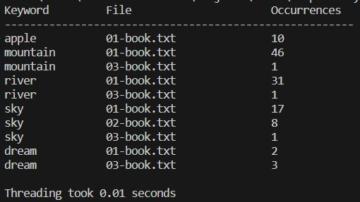
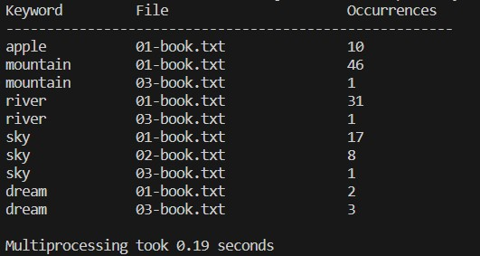

# Parallel Keyword Search in Text Files

This project demonstrates parallel and concurrent programming concepts in Python using two approaches:
1. **Threading**: Uses the `threading` module to search for keywords in text files concurrently.
2. **Multiprocessing**: Uses the `multiprocessing` module to distribute the search tasks among multiple processes.

Both approaches search through a list of text files for specific keywords and count how many times each keyword appears in each file. The results are displayed in a table format showing the file names and occurrence counts.

                                            

## Requirements

Make sure you have Python 3.x installed. No additional libraries are required as both threading and multiprocessing are part of Python's standard library.

## Usage

### 1. **Prepare Test Files**

Place the text files you want to search through in the `assets/` directory. 
There are three sample files already provided: `01-book.txt`, `02-book.txt`, and `03-book.txt`.

### 2. **Threading Search**

To run the keyword search using **threading**, execute the following command in your terminal:

```bash
python threading_search.py
```

The script will:

Search through all text files in the assets/ folder for the specified keywords.
Display a table showing which files contain the keywords and how many times they appear.

Example output:

```plaintext
Keyword         File                      Occurrences
-------------------------------------------------------
apple           01-book.txt               2         
apple           02-book.txt               1         
mountain        03-book.txt               3         
...
```
3. Multiprocessing Search
To run the keyword search using multiprocessing, execute the following command in your terminal:

```bash
python multiprocessing_search.py
```

The script behaves similarly to the threading version but uses multiple processes to handle the search tasks.

Example output:

```plaintext
Keyword         File                      Occurrences
-------------------------------------------------------
dream           01-book.txt               1         
river           03-book.txt               2         
...
```

4. Customizing Search Keywords

You can customize the list of keywords being searched by modifying the keywords variable in either script:

```python
keywords = ["apple", "mountain", "river", "sky", "dream"]
```

5. Performance Comparison
For performance comparison between threading and multiprocessing, you can test the scripts with larger files or multiple keywords. The scripts print the time taken to complete the search.

Notes
The scripts are designed to handle multiple text files stored in the assets/ folder.
The occurrence count for each keyword is case-sensitive, so "apple" and "Apple" will be treated as different words.
For large text files, multiprocessing may provide better performance, especially on multi-core systems.

